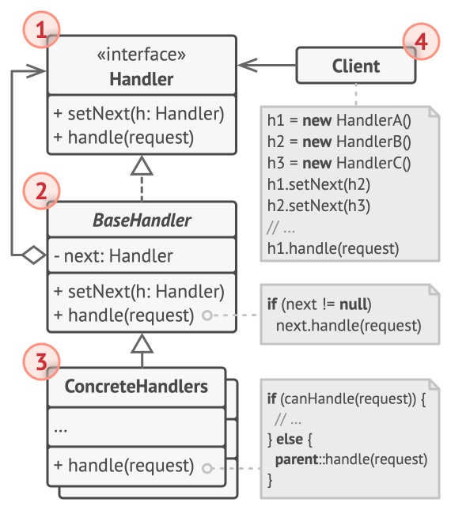

# Chain of Responsibility

## Intent

Chain of Responsibility is a behavioral design pattern that lets you pass requests along a chain of handlers. Upon receiving a request, each
handler decides either to process the request or to pass it to the next handler in the chain.

## Detailed Explanation of Chain of Responsibility Pattern with Real-World Examples

Real-world example

> A real-world example of the Chain of Responsibility pattern in Java is a technical support call center. When implementing this Java design
> pattern, each level of support represents a handler in the chain. When a customer calls in with an issue, the call is first received by a
> front-line support representative. If the issue is simple, the representative handles it directly. If the issue is more complex, the
> representative forwards the call to a second-level support technician. This process continues, with the call being escalated through
> multiple levels of support until it reaches a specialist who can resolve the problem. Each level of support represents a handler in the
> chain, and the call is passed along the chain until it finds an appropriate handler, thereby decoupling the request from the specific
> receiver.

In plain words

> It helps to build a chain of objects. A request enters from one end and keeps going from an object to another until it finds a suitable
> handler.

## When to Use the Chain of Responsibility Pattern in Java

Use Chain of Responsibility when

* More than one object may handle a request, and the handler isn't known a priori. The handler should be ascertained automatically.
* You want to issue a request to one of several objects without specifying the receiver explicitly.
* The set of objects that can handle a request should be specified dynamically.

## Real-World Applications of Chain of Responsibility Pattern in Java

* Event bubbling in GUI frameworks where an event might be handled at multiple levels of a UI component hierarchy
* Middleware frameworks where a request passes through a chain of processing objects
* Logging frameworks where messages can be passed through a series of loggers, each possibly handling them differently
* [java.util.logging.Logger#log()](http://docs.oracle.com/javase/8/docs/api/java/util/logging/Logger.html#log%28java.util.logging.Level,%20java.lang.String%29)
* [Apache Commons Chain](https://commons.apache.org/proper/commons-chain/index.html)
* [javax.servlet.Filter#doFilter()](http://docs.oracle.com/javaee/7/api/javax/servlet/Filter.html#doFilter-javax.servlet.ServletRequest-javax.servlet.ServletResponse-javax.servlet.FilterChain-)

## How to Implement

1. Declare the handler interface and describe the signature of a method for handling requests.
    
   Decide how the client will pass the request data into the method. The most flexible way is to convert the request into an object and pass
   it to the handling method as an argument.

2. To eliminate duplicate boilerplate code in concrete handlers, it might be worth creating an abstract base handler class, derived from the
   handler interface.
   This class should have a field for storing a reference to the next handler in the chain. Consider making the class immutable. However, if
   you plan to modify chains at runtime, you need to define a setter for altering the value of the reference field.
    
   You can also implement the convenient default behavior for the handling method, which is to forward the request to the next object unless
   there’s none left. Concrete handlers will be able to use this behavior by calling the parent method.

3. One by one create concrete handler subclasses and implement their handling methods. Each handler should make two decisions when receiving
   a request:
    * Whether it’ll process the request.
    * Whether it’ll pass the request along the chain.

4. The client may either assemble chains on its own or receive pre-built chains from other objects. In the latter case, you must implement
   some factory classes to build chains according to the configuration or environment settings.
5. The client may trigger any handler in the chain, not just the first one. The request will be passed along the chain until some handler
   refuses to pass it further or until it reaches the end of the chain.
6. Due to the dynamic nature of the chain, the client should be ready to handle the following scenarios:
    * The chain may consist of a single link.
    * Some requests may not reach the end of the chain.
    * Others may reach the end of the chain unhandled.

## Pros and Cons

| Pros                                                                                                                   | Cons                                                                                                                                       |
|------------------------------------------------------------------------------------------------------------------------|--------------------------------------------------------------------------------------------------------------------------------------------|
| You can control the order of request handling.                                                                         | It can be challenging to debug and understand the flow, especially if the chain is long and complex.                                       |
| Single Responsibility Principle. You can decouple classes that invoke operations from classes that perform operations. | The request might end up unhandled if the chain doesn't include a catch-all handler.                                                       |
| Open/Closed Principle. You can introduce new handlers into the app without breaking the existing client code.          | Performance concerns might arise due to potentially going through several handlers before finding the right one, or not finding it at all. |

