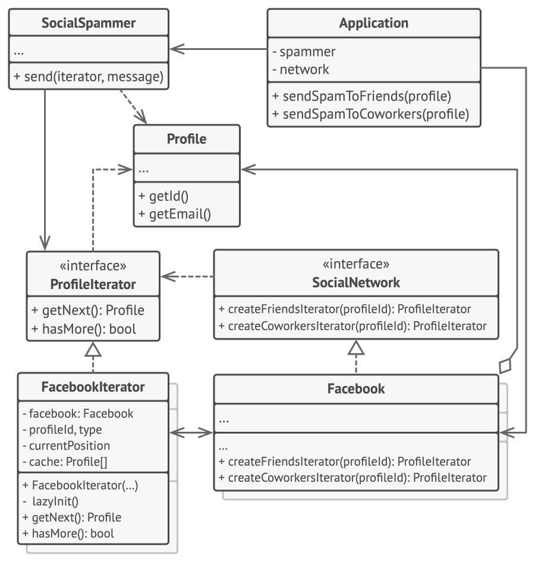

# Iterator

## Intent

Iterator is a behavioral design pattern that lets you traverse elements of a collection without exposing its underlying representation (
list, stack, tree, etc.).

## Detailed Explanation of Iterator Pattern with Real-World Examples

Real-world example

> Imagine visiting a library with a vast collection of books organized in different sections such as fiction, non-fiction, science, etc.
> Instead of searching through every shelf yourself, the librarian provides you with a specific guidebook or a digital catalog for each
> section. This guidebook acts as an "iterator," allowing you to go through the books section by section, or even skip to specific types of
> books, without needing to know how the books are organized on the shelves. Each guidebook handles the traversal through its section,
> providing a consistent and efficient way to access the books, much like how the Iterator design pattern offers a uniform method to
> traverse different data structures in a software application.

In plain words

> The Java Iterator Design Pattern provides a method to sequentially access elements of a collection without exposing its underlying
> structure. This pattern is widely used in Java programming for efficient data access.

## When to Use the Iterator Pattern in Java

Use the Iterator design pattern

* To access an aggregate object's contents without exposing its internal representation.
* To support multiple traversals of aggregate objects.
* To provide a uniform interface for traversing different aggregate structures.

## Real-World Applications of Iterator Pattern in Java

* Java Collections Framework utilizes iterators extensively to allow different ways to traverse through collections.
* Databases often use iterators to navigate through data records fetched through SQL queries.
* [java.util.Iterator](http://docs.oracle.com/javase/8/docs/api/java/util/Iterator.html)
* [java.util.Enumeration](http://docs.oracle.com/javase/8/docs/api/java/util/Enumeration.html)

## How to Implement

1. Declare the iterator interface. At the very least, it must have a method for fetching the next element from a collection. But for the
   sake of convenience you can add a couple of other methods, such as fetching the previous element, tracking the current position, and
   checking the end of the iteration.
2. Declare the collection interface and describe a method for fetching iterators. The return type should be equal to that of the iterator
   interface. You may declare similar methods if you plan to have several distinct groups of iterators.
3. Implement concrete iterator classes for the collections that you want to be traversable with iterators. An iterator object must be linked
   with a single collection instance. Usually, this link is established via the iterator’s constructor.
4. Implement the collection interface in your collection classes. The main idea is to provide the client with a shortcut for creating
   iterators, tailored for a particular collection class. The collection object must pass itself to the iterator’s constructor to establish
   a link between them.
5. Go over the client code to replace all the collection traversal code with the use of iterators. The client fetches a new iterator
   object each time it needs to iterate over the collection elements.

## Pros and Cons

| Pros                                                                                                                                                  | Cons                                                                                                          |
|-------------------------------------------------------------------------------------------------------------------------------------------------------|---------------------------------------------------------------------------------------------------------------|
| Single Responsibility Principle. You can clean up the client code and the collections by extracting bulky traversal algorithms into separate classes. | Applying the pattern can be an overkill if your app only works with simple collections.                       |
| Open/Closed Principle. You can implement new types of collections and iterators and pass them to existing code without breaking anything.             | Using an iterator may be less efficient than going through elements of some specialized collections directly. |
| You can iterate over the same collection in parallel because each iterator object contains its own iteration state.                                   |                                                                                                               |
| For the same reason, you can delay an iteration and continue it when needed.                                                                          |                                                                                                               |
