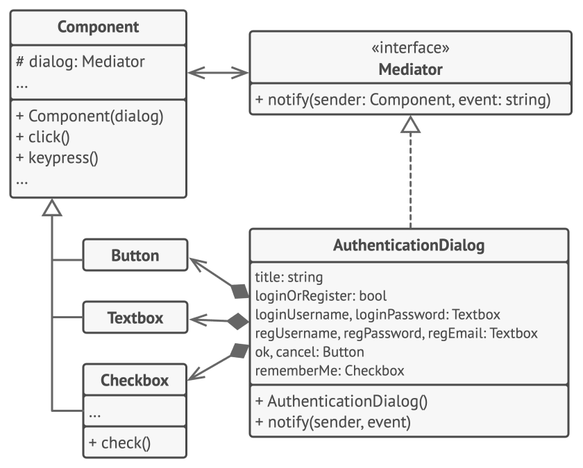

# Mediator

## Intent

The Mediator design pattern is intended to reduce the complexity of communication between multiple objects or classes in a system. It
achieves this by providing a centralized mediator class that handles the interactions between different classes, thus reducing their direct
dependencies on each other.

## Detailed Explanation of Mediator Pattern with Real-World Examples

Real-world example

> Imagine an air traffic control system at a busy airport, where the air traffic controller acts as a mediator. In this scenario, numerous
> airplanes wish to take off, land, or navigate around the airport's airspace. Instead of each pilot communicating directly with every other
> pilot, which could lead to confusion and potential accidents, all communication goes through the air traffic controller. The controller
> receives requests, processes them, and gives clear, organized instructions to each pilot. This centralized system reduces the complexity
> of
> communications and ensures safety and efficiency in managing the airport's operations. This is analogous to the Mediator design pattern in
> software, where a central mediator class handles and coordinates the interaction between different objects or systems.

In plain words

> Mediator decouples a set of classes by forcing their communications flow through a mediating object.

## When to Use the Mediator Pattern in Java

Use the Mediator pattern when

* A set of objects communicate in well-defined but complex ways. The resulting interdependencies are unstructured and difficult to
  understand
* Reusing an object is difficult because it refers to and communicates with many other objects
* A behavior that's distributed between several classes should be customizable without a lot of subclassing

## Real-World Applications of Mediator Pattern in Java

* All scheduleXXX() methods of [java.util.Timer](http://docs.oracle.com/javase/8/docs/api/java/util/Timer.html)
* [java.util.concurrent.Executor#execute()](http://docs.oracle.com/javase/8/docs/api/java/util/concurrent/Executor.html#execute-java.lang.Runnable-)
* submit() and invokeXXX() methods
  of [java.util.concurrent.ExecutorService](http://docs.oracle.com/javase/8/docs/api/java/util/concurrent/ExecutorService.html)
* scheduleXXX() methods
  of [java.util.concurrent.ScheduledExecutorService](http://docs.oracle.com/javase/8/docs/api/java/util/concurrent/ScheduledExecutorService.html)
* [java.lang.reflect.Method#invoke()](http://docs.oracle.com/javase/8/docs/api/java/lang/reflect/Method.html#invoke-java.lang.Object-java.lang.Object...-)
* Java Message Service (JMS) uses mediators to handle message exchanges between clients and servers.
* JavaBeans property change support class (java.beans.PropertyChangeSupport) acts as a mediator by handling communication between beans
  regarding property changes.

## How to Implement

1. Identify a group of tightly coupled classes which would benefit from being more independent (e.g., for easier maintenance or simpler
   reuse of these classes).
2. Declare the mediator interface and describe the desired communication protocol between mediators and various components. In most cases, a
   single method for receiving notifications from components is sufficient.
3. This interface is crucial when you want to reuse component classes in different contexts. As long as the component works with its
   mediator via the generic interface, you can link the component with a different implementation of the mediator.
4. Implement the concrete mediator class. Consider storing references to all components inside the mediator. This way, you could call any
   component from the mediator’s methods.
5. You can go even further and make the mediator responsible for the creation and destruction of component objects. After this, the mediator
   may resemble a factory or a facade.
6. Components should store a reference to the mediator object. The connection is usually established in the component’s constructor, where a
   mediator object is passed as an argument.
7. Change the components’ code so that they call the mediator’s notification method instead of methods on other components. Extract the code
   that involves calling other components into the mediator class. Execute this code whenever the mediator receives notifications from that
   component.

## Pros and Cons

| Pros                                                                                                                                                             | Cons                                                                                                                     |
|------------------------------------------------------------------------------------------------------------------------------------------------------------------|--------------------------------------------------------------------------------------------------------------------------|
| Single Responsibility Principle. You can extract the communications between various components into a single place, making it easier to comprehend and maintain. | Mediator can become a god object coupled with all classes in the system, gaining too much responsibility and complexity. |
| Open/Closed Principle. You can introduce new mediators without having to change the actual components.                                                           |                                                                                                                          |
| You can reduce coupling between various components of a program.                                                                                                 |                                                                                                                          |
| You can reuse individual components more easily.                                                                                                                 |                                                                                                                          |
