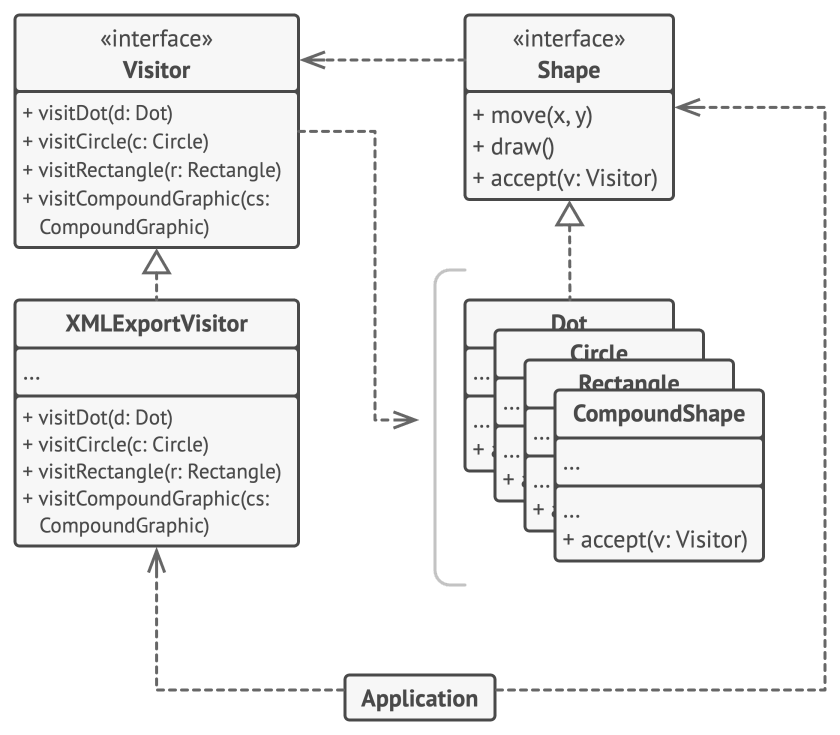

# Visitor

## Intent

Visitor is a behavioral design pattern that lets you separate algorithms from the objects on which they operate.

## Detailed Explanation of Visitor Pattern with Real-World Examples

Real-world example

> An analogous real-world example of the Visitor design pattern can be seen in a museum tour guide system. Imagine a museum where visitors
> can take guided tours to learn about different types of exhibits, such as paintings, sculptures, and historical artifacts. Each exhibit
> type
> requires a different explanation, which is provided by specialized tour guides.
>
> In this scenario, the exhibits are like the elements in the Visitor pattern, and the tour guides are like the visitors. The museum
> structure remains unchanged, but new guides with new types of tours (operations) can be added without modifying the exhibits themselves.
> Each guide (visitor) implements a specific way to interact with the exhibits, providing detailed explanations according to their
> specialization, thereby separating the operations from the objects they operate on.

In plain words

> The Java Visitor pattern defines operations that can be performed on nodes of various data structures, enhancing Java application
> extensibility.

## Use the Visitor pattern when

* Implement the Visitor design pattern in Java when you need to efficiently perform operations across groups of similar objects without
  modifying their classes, and you want to avoid polluting their classes with this operation.
* Use it when a class structure is stable, but you need to perform new operations on the structure without changing it.
* It's beneficial when the set of classes are fixed and only the operations need to be extended.

## Real-World Applications of Visitor Pattern in Java

* Compiler design, where the Visitor pattern can be used for operations like pretty printing, semantic checks, etc.
* Document structure processing (e.g., HTML, XML).
* [Apache Wicket](https://github.com/apache/wicket) component tree,
  see [MarkupContainer](https://github.com/apache/wicket/blob/b60ec64d0b50a611a9549809c9ab216f0ffa3ae3/wicket-core/src/main/java/org/apache/wicket/MarkupContainer.java)
* [javax.lang.model.element.AnnotationValue](http://docs.oracle.com/javase/8/docs/api/javax/lang/model/element/AnnotationValue.html)
  and [AnnotationValueVisitor](http://docs.oracle.com/javase/8/docs/api/javax/lang/model/element/AnnotationValueVisitor.html)
* [javax.lang.model.element.Element](http://docs.oracle.com/javase/8/docs/api/javax/lang/model/element/Element.html)
  and [Element Visitor](http://docs.oracle.com/javase/8/docs/api/javax/lang/model/element/ElementVisitor.html)
* [java.nio.file.FileVisitor](http://docs.oracle.com/javase/8/docs/api/java/nio/file/FileVisitor.html)

## How to Implement

1. Declare the visitor interface with a set of “visiting” methods, one per each concrete element class that exists in the program.
2. Declare the element interface. If you’re working with an existing element class hierarchy, add the abstract “acceptance” method to the
   base class of the hierarchy. This method should accept a visitor object as an argument.
3. Implement the acceptance methods in all concrete element classes. These methods must simply redirect the call to a visiting method on the
   incoming visitor object which matches the class of the current element.
4. The element classes should only work with visitors via the visitor interface. Visitors, however, must be aware of all concrete element
   classes, referenced as parameter types of the visiting methods.
5. For each behavior that can’t be implemented inside the element hierarchy, create a new concrete visitor class and implement all of the
   visiting methods.

   You might encounter a situation where the visitor will need access to some private members of the element class. In this case, you can
   either make these fields or methods public, violating the element’s encapsulation, or nest the visitor class in the element class. The
   latter is only possible if you’re lucky to work with a programming language that supports nested classes.
6. The client must create visitor objects and pass them into elements via “acceptance” methods.

## Pros and Cons

| Pros                                                                                                                                                                                                                                                     | Cons                                                                                                                           |
|----------------------------------------------------------------------------------------------------------------------------------------------------------------------------------------------------------------------------------------------------------|--------------------------------------------------------------------------------------------------------------------------------|
| Open/Closed Principle. You can introduce a new behavior that can work with objects of different classes without changing these classes.                                                                                                                  | You need to update all visitors each time a class gets added to or removed from the element hierarchy.                         | 
| Single Responsibility Principle. You can move multiple versions of the same behavior into the same class.                                                                                                                                                | Visitors might lack the necessary access to the private fields and methods of the elements that they’re supposed to work with. |
| A visitor object can accumulate some useful information while working with various objects. This might be handy when you want to traverse some complex object structure, such as an object tree, and apply the visitor to each object of this structure. |                                                                                                                                |
