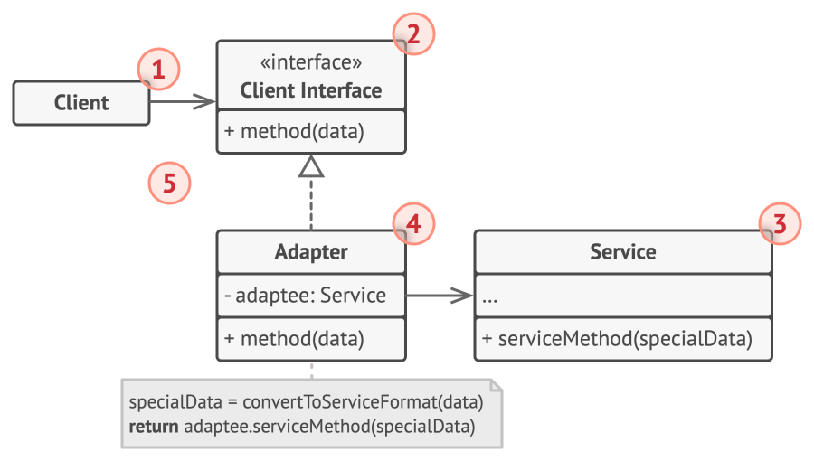

# Adapter

## Intent

Adapter is a structural design pattern that allows objects with incompatible interfaces to collaborate.

## Detailed Explanation of Adapter Pattern with Real-World Examples

Real-world example

> Consider that you have some pictures on your memory card and you need to transfer them to your computer. To transfer them, you need some
> kind of adapter that is compatible with your computer ports so that you can attach a memory card to your computer. In this case card
> reader
> is an adapter. Another example would be the famous power adapter; a three-legged plug can't be connected to a two-pronged outlet, it needs
> to use a power adapter that makes it compatible with the two-pronged outlets. Yet another example would be a translator translating words
> spoken by one person to another

In plain words

> Adapter pattern lets you wrap an otherwise incompatible object in an adapter to make it compatible with another class.

## When to Use the Adapter Pattern in Java

Use the Adapter pattern in Java when

* You want to use an existing class, and its interface does not match the one you need
* You want to create a reusable class that cooperates with unrelated or unforeseen classes, that is, classes that don't necessarily have
  compatible interfaces
* You need to use several existing subclasses, but it's impractical to adapt their interface by subclassing everyone. An object adapter can
  adapt the interface of its parent class.
* Most of the applications using third-party libraries use adapters as a middle layer between the application and the 3rd party library to
  decouple the application from the library. If another library has to be used only an adapter for the new library is required without
  having to change the application code.

## Real-World Applications of Adapter Pattern in Java

* `java.io.InputStreamReader` and `java.io.OutputStreamWriter` in the Java IO library.
* GUI component libraries that allow for plug-ins or adapters to convert between different GUI component interfaces.
* [java.util.Arrays#asList()](http://docs.oracle.com/javase/8/docs/api/java/util/Arrays.html#asList%28T...%29)
* [java.util.Collections#list()](https://docs.oracle.com/javase/8/docs/api/java/util/Collections.html#list-java.util.Enumeration-)
* [java.util.Collections#enumeration()](https://docs.oracle.com/javase/8/docs/api/java/util/Collections.html#enumeration-java.util.Collection-)
* [javax.xml.bind.annotation.adapters.XMLAdapter](http://docs.oracle.com/javase/8/docs/api/javax/xml/bind/annotation/adapters/XmlAdapter.html#marshal-BoundType-)

## How to Implement

1. Make sure that you have at least two classes with incompatible interfaces:
    - A useful service class, which you can’t change (often 3rd-party, legacy or with lots of existing dependencies).
    - One or several client classes that would benefit from using the service class.
2. Declare the client interface and describe how clients communicate with the service.
3. Create the adapter class and make it follow the client interface. Leave all the methods empty for now.
4. Add a field to the adapter class to store a reference to the service object. The common practice is to initialize this field via the
   constructor, but sometimes it’s more convenient to pass it to the adapter when calling its methods.
5. One by one, implement all methods of the client interface in the adapter class. The adapter should delegate most of the real work to the
   service object, handling only the interface or data format conversion.
6. Clients should use the adapter via the client interface. This will let you change or extend the adapters without affecting the client
   code.

## Pros and Cons

| Pros                                                                                                                                                                                            | Cons                                                                                                                                                                                                              |
|-------------------------------------------------------------------------------------------------------------------------------------------------------------------------------------------------|-------------------------------------------------------------------------------------------------------------------------------------------------------------------------------------------------------------------|
| Single Responsibility Principle. You can separate the interface or data conversion code from the primary business logic of the program.                                                         | The overall complexity of the code increases because you need to introduce a set of new interfaces and classes. Sometimes it’s simpler just to change the service class so that it matches the rest of your code. |
| Open/Closed Principle. You can introduce new types of adapters into the program without breaking the existing client code, as long as they work with the adapters through the client interface. |                                                                                                                                                                                                                   |
