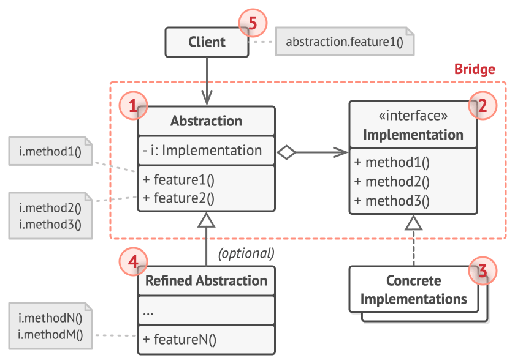

# Bridge

## Intent

Bridge is a structural design pattern that lets you split a large class or a set of closely related classes into two separate
hierarchies—abstraction and implementation—which can be developed independently of each other.

## Detailed Explanation of Bridge Pattern with Real-World Examples

Real-world example

> In Java, the Bridge pattern is commonly used in GUI frameworks, database drivers, and device drivers. For instance, a universal remote
> control (abstraction) can operate various TV brands (implementations) through a consistent interface.
>
> Imagine a universal remote control (abstraction) that can operate different brands and types of televisions (implementations). The remote
> control provides a consistent interface for operations like turning on/off, changing channels, and adjusting the volume. Each television
> brand or type has its own specific implementation of these operations. By using the Bridge pattern, the remote control interface is
> decoupled from the television implementations, allowing the remote control to work with any television regardless of its brand or internal
> workings. This separation allows new television models to be added without changing the remote control's code, and different remote
> controls
> can be developed to work with the same set of televisions.

In Plain Words

> Bridge pattern is about preferring composition to inheritance. Implementation details are pushed from a hierarchy to another object with a
> separate hierarchy.

## When to Use the Bridge Pattern in Java

Consider using the Bridge pattern when:

* You need to avoid a permanent binding between an abstraction and its implementation, such as when the implementation must be chosen or
  switched at runtime.
* Both the abstractions and their implementations should be extendable via subclassing, allowing independent extension of each component.
* Changes to the implementation of an abstraction should not affect clients, meaning their code should not require recompilation.
* You encounter a large number of classes in your hierarchy, indicating the need to split an object into two parts, a concept referred to
  as "nested generalizations" by Rumbaugh.
* You want to share an implementation among multiple objects, potentially using reference counting, while keeping this detail hidden from
  the client, as exemplified by Coplien's String class, where multiple objects can share the same string representation.

## Real-World Applications of Bridge Pattern in Java

* GUI Frameworks where the abstraction is the window, and the implementation could be the underlying OS windowing system.
* Database Drivers where the abstraction is a generic database interface, and the implementations are database-specific drivers.
* Device Drivers where the abstraction is the device-independent code, and the implementation is the device-dependent code.

## How to Implement

1. Identify the orthogonal dimensions in your classes. These independent concepts could be: abstraction/platform, domain/infrastructure,
   front-end/back-end, or interface/implementation.
2. See what operations the client needs and define them in the base abstraction class.
3. Determine the operations available on all platforms. Declare the ones that the abstraction needs in the general implementation interface.
4. For all platforms in your domain create concrete implementation classes, but make sure they all follow the implementation interface.
5. Inside the abstraction class, add a reference field for the implementation type. The abstraction delegates most of the work to the
   implementation object that’s referenced in that field.
6. If you have several variants of high-level logic, create refined abstractions for each variant by extending the base abstraction class.
7. The client code should pass an implementation object to the abstraction’s constructor to associate one with the other. After that, the
   client can forget about the implementation and work only with the abstraction object.

## Pros and Cons

| Pros                                                                                                                                 | Cons                                                                                                                                   |
|--------------------------------------------------------------------------------------------------------------------------------------|----------------------------------------------------------------------------------------------------------------------------------------|
| You can create platform-independent classes and apps.                                                                                | Increased Complexity: The pattern can complicate the system architecture and code, especially for clients unfamiliar with the pattern. | 
| The client code works with high-level abstractions. It isn’t exposed to the platform details.                                        | Runtime Overhead: The extra layer of abstraction can introduce a performance penalty, although it is often negligible in practice.     |
| Open/Closed Principle. You can introduce new abstractions and implementations independently from each other.                         |                                                                                                                                        |
| Single Responsibility Principle. You can focus on high-level logic in the abstraction and on platform details in the implementation. |                                                                                                                                        |
