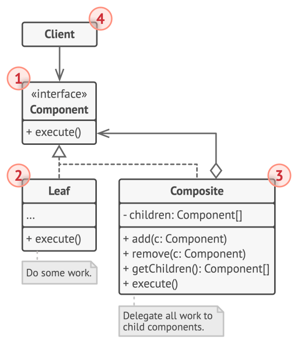

# Composite

## Intent

Composite is a structural design pattern that lets you compose objects into tree structures and then work with these structures as if they
were individual objects.

## Detailed Explanation of Composite Pattern with Real-World Examples

Real-world example

> In a real-world example, consider a company with a complex organizational structure. The company consists of various departments, each of
> which can contain sub-departments, and ultimately individual employees. The Composite Design Pattern can be used to represent this
> structure. Each department and employee are treated as a node in a tree structure, where departments can contain other departments or
> employees, but employees are leaf nodes with no children. This allows the company to perform operations uniformly, such as calculating
> total
> salaries or printing the organizational chart, by treating individual employees and entire departments in the same way.

In plain words

> The Composite Design Pattern lets clients uniformly treat individual objects and compositions of objects.

## When to Use the Composite Pattern in Java

Use the Composite pattern when

* You want to represent part-whole hierarchies of objects.
* You want clients to be able to ignore the difference between compositions of objects and individual objects. Clients will treat all
  objects in the composite structure uniformly.

## Real-World Applications of Composite Pattern in Java

* Graphical user interfaces where components can contain other components (e.g., panels containing buttons, labels, other panels).
* File system representations where directories can contain files and other directories.
* Organizational structures where a department can contain sub-departments and employees.
* [java.awt.Container](http://docs.oracle.com/javase/8/docs/api/java/awt/Container.html)
  and [java.awt.Component](http://docs.oracle.com/javase/8/docs/api/java/awt/Component.html)
* [Apache Wicket](https://github.com/apache/wicket) component tree,
  see [Component](https://github.com/apache/wicket/blob/91e154702ab1ff3481ef6cbb04c6044814b7e130/wicket-core/src/main/java/org/apache/wicket/Component.java)
  and [MarkupContainer](https://github.com/apache/wicket/blob/b60ec64d0b50a611a9549809c9ab216f0ffa3ae3/wicket-core/src/main/java/org/apache/wicket/MarkupContainer.java)

## How to Implement

1. Make sure that the core model of your app can be represented as a tree structure. Try to break it down into simple elements and
   containers. Remember that containers must be able to contain both simple elements and other containers.
2. Declare the component interface with a list of methods that make sense for both simple and complex components.
3. Create a leaf class to represent simple elements. A program may have multiple different leaf classes.
4. Create a container class to represent complex elements. In this class, provide an array field for storing references to sub-elements. The
   array must be able to store both leaves and containers, so make sure it’s declared with the component interface type.
5. While implementing the methods of the component interface, remember that a container is supposed to be delegating most of the work to
   sub-elements.
6. Finally, define the methods for adding and removal of child elements in the container.

   Keep in mind that these operations can be declared in the component interface. This would violate the Interface Segregation Principle
   because the methods will be empty in the leaf class. However, the client will be able to treat all the elements equally, even when
   composing the tree.

## Pros and Cons

| Pros                                                                                                                                              | Cons                                                                                                 |
|---------------------------------------------------------------------------------------------------------------------------------------------------|------------------------------------------------------------------------------------------------------|
| You can work with complex tree structures more conveniently: use polymorphism and recursion to your advantage.                                    | Can make the design overly general. It might be difficult to restrict the components of a composite. |
| Open/Closed Principle. You can introduce new element types into the app without breaking the existing code, which now works with the object tree. | Can make it harder to restrict the types of components in a composite.                               |      |
