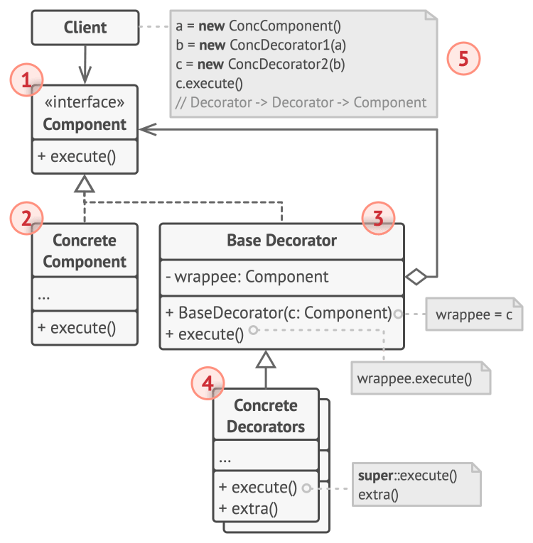

# Decorator

## Intent

Decorator is a structural design pattern that lets you attach new behaviors to objects by placing these objects inside special wrapper
objects that contain the behaviors.

## Detailed Explanation of Decorator Pattern with Real-World Examples

Real-world example

> Imagine a coffee shop where you can customize your coffee order. You start with a basic coffee, and you can add different ingredients like
> milk, sugar, whipped cream, and so on. Each addition is like a decorator in the Decorator design pattern. The base coffee object can be
> decorated with additional functionality (flavors, toppings) dynamically. For example, you can start with a plain coffee object, then wrap
> it
> with a milk decorator, followed by a sugar decorator, and finally a whipped cream decorator. Each decorator adds new features or modifies
> the behavior of the coffee object, similar to how the Decorator pattern works in software design.

In plain words

> Decorator pattern lets you dynamically change the behavior of an object at run time by wrapping them in an object of a decorator class.

## When to Use the Decorator Pattern in Java

Decorator is used to:

* Add responsibilities to individual objects dynamically and transparently, that is, without affecting other objects, a key feature of Java
  design patterns.
* For responsibilities that can be withdrawn.
* When extending a class is impractical due to the proliferation of subclasses that could result.
* For when a class definition might be hidden or otherwise unavailable for subclassing.

## Real-World Applications of Decorator Pattern in Java

* GUI toolkits often use decorators to dynamically add behaviors like scrolling, borders, or layout management to components.
* The [java.io.InputStream](http://docs.oracle.com/javase/8/docs/api/java/io/InputStream.html), [java.io.OutputStream](http://docs.oracle.com/javase/8/docs/api/java/io/OutputStream.html), [java.io.Reader](http://docs.oracle.com/javase/8/docs/api/java/io/Reader.html)
and [java.io.Writer](http://docs.oracle.com/javase/8/docs/api/java/io/Writer.html) classes in Java are well-known examples utilizing the
Decorator pattern.

* [java.util.Collections#synchronizedXXX()](http://docs.oracle.com/javase/8/docs/api/java/util/Collections.html#synchronizedCollection-java.util.Collection-)
* [java.util.Collections#unmodifiableXXX()](http://docs.oracle.com/javase/8/docs/api/java/util/Collections.html#unmodifiableCollection-java.util.Collection-)
* [java.util.Collections#checkedXXX()](http://docs.oracle.com/javase/8/docs/api/java/util/Collections.html#checkedCollection-java.util.Collection-java.lang.Class-)

## How to Implement

1. Make sure your business domain can be represented as a primary component with multiple optional layers over it.
2. Figure out what methods are common to both the primary component and the optional layers. Create a component interface and declare those
   methods there.
3. Create a concrete component class and define the base behavior in it.
4. Create a base decorator class. It should have a field for storing a reference to a wrapped object. The field should be declared with the
   component interface type to allow linking to concrete components as well as decorators. The base decorator must delegate all work to the
   wrapped object.
5. Make sure all classes implement the component interface.
6. Create concrete decorators by extending them from the base decorator. A concrete decorator must execute its behavior before or after the
   call to the parent method (which always delegates to the wrapped object).
7. The client code must be responsible for creating decorators and composing them in the way the client needs.

## Pros and Cons

| Pros                                                                                                                                                | Cons                                                                                                                    |
|-----------------------------------------------------------------------------------------------------------------------------------------------------|-------------------------------------------------------------------------------------------------------------------------|
| You can extend an object’s behavior without making a new subclass.                                                                                  | It’s hard to remove a specific wrapper from the wrappers stack.                                                         |
| You can add or remove responsibilities from an object at runtime.                                                                                   | It’s hard to implement a decorator in such a way that its behavior doesn’t depend on the order in the decorators stack. |
| You can combine several behaviors by wrapping an object into multiple decorators.                                                                   | The initial configuration code of layers might look pretty ugly.                                                        |
| Single Responsibility Principle. You can divide a monolithic class that implements many possible variants of behavior into several smaller classes. |                                                                                                                         |
