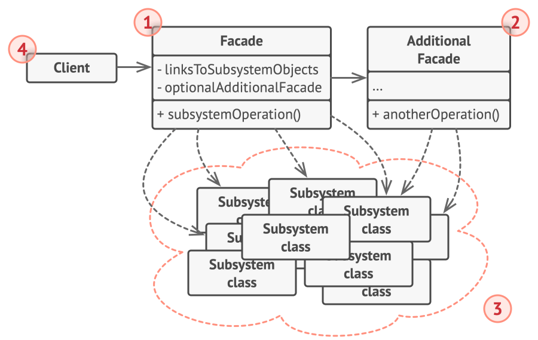

# Facade

## Intent

Facade is a structural design pattern that provides a simplified interface to a library, a framework, or any other complex set of classes.

## Detailed Explanation of Facade Pattern with Real-World Examples

Real-world example

> Imagine a home theater system with multiple components: a DVD player, projector, surround sound system, and lights. Each component has a
> complex interface with numerous functions and settings. To simplify the use of the home theater system, a remote control (the Facade) is
> provided. The remote control offers a unified interface with simple buttons like "Play Movie," "Stop," "Pause," and "Volume Up/Down,"
> which
> internally communicate with the various components, managing their interactions. This makes the system easier to use without needing to
> understand the detailed operations of each component.

In plain words

> Facade pattern provides a simplified interface to a complex subsystem.

## When to Use the Facade Pattern in Java

Use the Facade pattern in Java when:

* You want to provide a simple interface to a complex subsystem.
* Subsystems are getting more complex and depend on multiple classes, but most clients only need a part of the functionality.
* There is a need to layer your subsystems. Use a facade to define an entry point to each subsystem level.
* You want to reduce dependencies and enhance code readability in Java development.

## Real-World Applications of Facade Pattern in Java

* Java libraries such as java.net.URL and javax.faces.context.FacesContext use Facade to simplify complex underlying classes.
* In many Java frameworks, facades are used to simplify the usage of APIs by providing a simpler interface to more complex underlying code
  structures.

## How to Implement

1. Check whether it’s possible to provide a simpler interface than what an existing subsystem already provides. You’re on the right track if
   this interface makes the client code independent from many of the subsystem’s classes.
2. Declare and implement this interface in a new facade class. The facade should redirect the calls from the client code to appropriate
   objects of the subsystem. The facade should be responsible for initializing the subsystem and managing its further life cycle unless the
   client code already does this.
3. To get the full benefit from the pattern, make all the client code communicate with the subsystem only via the facade. Now the client
   code is protected from any changes in the subsystem code. For example, when a subsystem gets upgraded to a new version, you will only
   need to modify the code in the facade.
4. If the facade becomes too big, consider extracting part of its behavior to a new, refined facade class.

## Pros and Cons

| Pros                                                          | Cons                                                               |
|---------------------------------------------------------------|--------------------------------------------------------------------|
| You can isolate your code from the complexity of a subsystem. | A facade can become a god object coupled to all classes of an app. |
