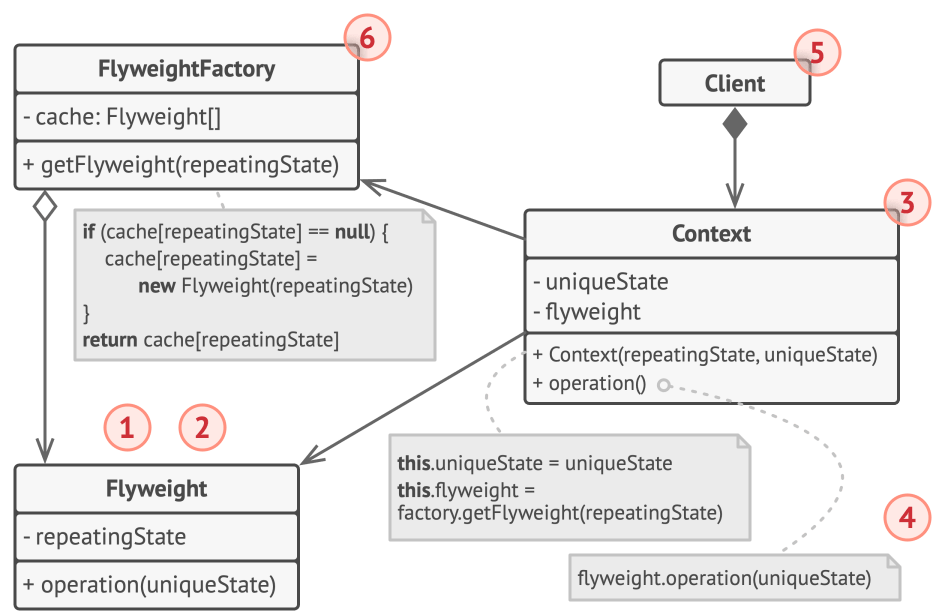

# Flyweight

## Intent

Flyweight is a structural design pattern that lets you fit more objects into the available amount of RAM by sharing common parts of state
between multiple objects instead of keeping all of the data in each object.

## Detailed Explanation of Flyweight Pattern with Real-World Examples

Real-world example

> A real-world application of the Flyweight pattern in Java can be seen in text editors like Microsoft Word or Google Docs. These
> applications use Flyweight to efficiently manage memory by sharing character objects, reducing the memory footprint significantly. In such
> applications, each character in a document could potentially be a separate object, which would be highly inefficient in terms of memory
> usage. Instead, the Flyweight pattern can be used to share character objects. For instance, all instances of the letter 'A' can share a
> single 'A' object with its intrinsic state (e.g., the shape of the character). The extrinsic state, such as the position, font, and color,
> can be stored separately and applied as needed. This way, the application efficiently manages memory by reusing existing objects for
> characters that appear multiple times.

In plain words

> It is used to minimize memory usage or computational expenses by sharing as much as possible with similar objects.

## When to Use the Flyweight Pattern in Java

The Flyweight pattern's effectiveness depends heavily on how and where it's used. Apply the Flyweight pattern when all the following are
true:

* The Flyweight pattern is particularly effective in Java applications that use a large number of objects.
* When storage costs are high due to the quantity of objects, Flyweight helps by sharing intrinsic data and managing extrinsic state
  separately.
* Most of the object state can be made extrinsic.
* Many groups of objects may be replaced by relatively few shared objects once the extrinsic state is removed.
* The application doesn't depend on object identity. Since flyweight objects may be shared, identity tests will return true for conceptually
  distinct objects.

## Real-World Applications of Flyweight Pattern in Java

* [java.lang.Integer#valueOf(int)](http://docs.oracle.com/javase/8/docs/api/java/lang/Integer.html#valueOf%28int%29) and similarly for Byte,
  Character and other wrapped types.
* Java’s String class utilizes the Flyweight pattern to manage string literals efficiently.
* GUI applications often use Flyweight for sharing objects like fonts or graphical components, thereby conserving memory and improving
  performance.

## How to Implement

1. Divide fields of a class that will become a flyweight into two parts:
    - the intrinsic state: the fields that contain unchanging data duplicated across many objects
    - the extrinsic state: the fields that contain contextual data unique to each object
2. Leave the fields that represent the intrinsic state in the class, but make sure they’re immutable. They should take their initial values
   only inside the constructor.
3. Go over methods that use fields of the extrinsic state. For each field used in the method, introduce a new parameter and use it instead
   of the field.
4. Optionally, create a factory class to manage the pool of flyweights. It should check for an existing flyweight before creating a new one.
   Once the factory is in place, clients must only request flyweights through it. They should describe the desired flyweight by passing its
   intrinsic state to the factory.
5. The client must store or calculate values of the extrinsic state (context) to be able to call methods of flyweight objects. For the sake
   of convenience, the extrinsic state along with the flyweight-referencing field may be moved to a separate context class.

## Pros and Cons

| Pros                                                                   | Cons                                                                    |
|------------------------------------------------------------------------|-------------------------------------------------------------------------|
| Reduces the number of instances of an object, conserving memory.       | Increases complexity by adding the management layer for shared objects. |
| Centralizes state management, reducing the risk of inconsistent state. | Potential overhead in accessing shared objects if not well implemented. |
