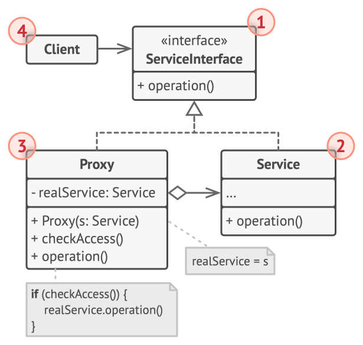

# Proxy

## Intent

Proxy is a structural design pattern that lets you provide a substitute or placeholder for another object. A proxy controls access to the
original object, allowing you to perform something either before or after the request gets through to the original object.

## Detailed Explanation of Proxy Pattern with Real-World Examples

Real-world example

> In a real-world scenario, consider a security guard at a gated community. The security guard acts as a proxy for the residents. When a
> visitor arrives, the guard checks the visitor's credentials and permissions before allowing them access to the community. If the visitor is
> authorized, the guard grants entry; if not, entry is denied. This ensures that only authorized individuals can access the community, much
> like a Proxy design pattern controls access to a specific object.

In plain words

> Utilizing the Java Proxy pattern, a class encapsulates the functionality of another, streamlining access control and operation efficiency.

## When to Use the Proxy Pattern in Java

Proxy is applicable whenever there is a need for a more versatile or sophisticated reference to an object than a simple pointer. Here are
several common situations in which the Proxy pattern is applicable. Typically, the proxy pattern is used to

* Control access to another object
* Lazy initialization
* Implement logging
* Facilitate network connection
* Count references to an object
* Provide a local representation for an object that is in a different address space.

## Real-World Applications of Proxy Pattern in Java

* Virtual Proxies: In applications that need heavy resources like large images or complex calculations, virtual proxies can be used to
  instantiate objects only when needed.
* Remote Proxies: Used in remote method invocation (RMI) to manage interactions with remote objects.
* Protection Proxies: Control access to the original object to ensure proper authorization.
* [java.lang.reflect.Proxy](http://docs.oracle.com/javase/8/docs/api/java/lang/reflect/Proxy.html)
* [Apache Commons Proxy](https://commons.apache.org/proper/commons-proxy/)
* Mocking frameworks [Mockito](https://site.mockito.org/),[Powermock](https://powermock.github.io/), [EasyMock](https://easymock.org/)
* [UIAppearance](https://developer.apple.com/documentation/uikit/uiappearance)

## How to Implement

1. If there’s no pre-existing service interface, create one to make proxy and service objects interchangeable. Extracting the interface from
   the service class isn’t always possible, because you’d need to change all of the service’s clients to use that interface. Plan B is to
   make the proxy a subclass of the service class, and this way it’ll inherit the interface of the service.
2. Create the proxy class. It should have a field for storing a reference to the service. Usually, proxies create and manage the whole life
   cycle of their services. On rare occasions, a service is passed to the proxy via a constructor by the client.
3. Implement the proxy methods according to their purposes. In most cases, after doing some work, the proxy should delegate the work to the
   service object.
4. Consider introducing a creation method that decides whether the client gets a proxy or a real service. This can be a simple static method
   in the proxy class or a full-blown factory method.
5. Consider implementing lazy initialization for the service object.

## Pros and Cons

| Pros                                                                                          | Cons                                                                                   |
|-----------------------------------------------------------------------------------------------|----------------------------------------------------------------------------------------|
| You can control the service object without clients knowing about it.                          | The code may become more complicated since you need to introduce a lot of new classes. |
| You can manage the lifecycle of the service object when clients don’t care about it.          | The response from the service might get delayed.                                       |
| The proxy works even if the service object isn’t ready or is not available.                   |                                                                                        |
| Open/Closed Principle. You can introduce new proxies without changing the service or clients. |                                                                                        |
