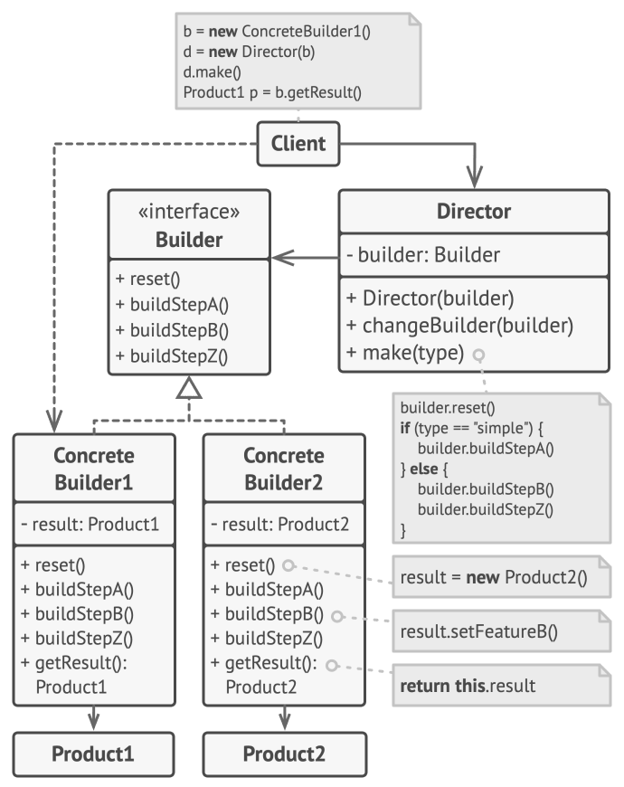

# Builder

## Intent

Builder is a creational design pattern that lets you construct complex objects step by step. The pattern allows you to produce different types and representations of an object using the same construction code.

## Detailed Explanation of Builder Pattern with Real-World Examples

Real-world example

> The Java Builder pattern is particularly useful in scenarios where object creation involves numerous parameters.
>
> Imagine you are building a customizable sandwich at a deli. The Builder design pattern in this context would involve a SandwichBuilder that allows you to specify each component of the sandwich, such as the type of bread, meat, cheese, vegetables, and condiments. Instead of having to know how to construct the sandwich from scratch, you use the SandwichBuilder to add each desired component step-by-step, ensuring you get exactly the sandwich you want. This separation of construction from the final product representation ensures that the same construction process can yield different types of sandwiches based on the specified components.

In plain words

> Allows you to create different flavors of an object while avoiding constructor pollution. Useful when there could be several flavors of an object. Or when there are a lot of steps involved in creation of an object.

## When to Use the Builder Pattern in Java

* The Builder pattern is ideal for Java applications requiring complex object creation.
* The algorithm for creating a complex object should be independent of the parts that make up the object and how they're assembled
* The construction process must allow different representations for the object that's constructed
* It's particularly useful when a product requires a lot of steps to be created and when these steps need to be executed in a specific sequence

## Real-World Applications

* StringBuilder in Java for constructing strings.
* java.lang.StringBuffer used to create mutable string objects.
* Java.nio.ByteBuffer as well as similar buffers such as FloatBuffer, IntBuffer, and others
* javax.swing.GroupLayout.Group#addComponent()
* Various GUI builders in IDEs that construct UI components.
* All implementations of [java.lang.Appendable](http://docs.oracle.com/javase/8/docs/api/java/lang/Appendable.html)
* [Apache Camel builders](https://github.com/apache/camel/tree/0e195428ee04531be27a0b659005e3aa8d159d23/camel-core/src/main/java/org/apache/camel/builder)
* [Apache Commons Option.Builder](https://commons.apache.org/proper/commons-cli/apidocs/org/apache/commons/cli/Option.Builder.html)

## How to Implement

1. Make sure that you can clearly define the common construction steps for building all available product representations. Otherwise, you
   won’t be able to proceed with implementing the pattern.
2. Declare these steps in the base builder interface.
3. Create a concrete builder class for each of the product representations and implement their construction steps.
4. Don’t forget about implementing a method for fetching the result of the construction. The reason why this method can’t be declared inside
   the builder interface is that various builders may construct products that don’t have a common interface. Therefore, you don’t know what
   would be the return type for such a method. However, if you’re dealing with products from a single hierarchy, the fetching method can be
   safely added to the base interface.
5. Think about creating a director class. It may encapsulate various ways to construct a product using the same builder object.
6. The client code creates both the builder and the director objects. Before construction starts, the client must pass a builder object to
   the director. Usually, the client does this only once, via parameters of the director’s class constructor. The director uses the builder
   object in all further construction. There’s an alternative approach, where the builder is passed to a specific product construction
   method of the director.
7. The construction result can be obtained directly from the director only if all products follow the same interface. Otherwise, the client
   should fetch the result from the builder.

## Pros and Cons

| Pros                                                                                                               | Cons                                                                                                   |
|--------------------------------------------------------------------------------------------------------------------|--------------------------------------------------------------------------------------------------------|
| You can construct objects step-by-step, defer construction steps or run steps recursively.                         | The overall complexity of the code increases since the pattern requires creating multiple new classes. |
| You can reuse the same construction code when building various representations of products.                        |                                                                                                        |
| Single Responsibility Principle. You can isolate complex construction code from the business logic of the product. |                                                                                                        |

